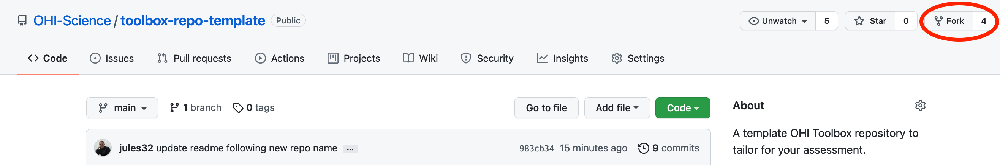
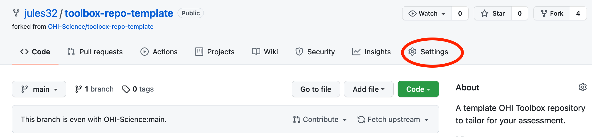

# OHI Toolbox {#toolbox}

**OHI assessments use our OHI Toolbox software, which helps our work be transparent and reproducible.**  

The OHI Toolbox is software to calculate OHI scores. You will be able to incorporate your data and models to represent your regions by using the Toolbox.

## The OHI Toolbox and open data science

The OHI Toolbox depends upon the 'open data science tools' R, RStudio, Git, and GitHub. They are free to download and use, they are cross-platform (meaning they work on OSX and Windows), and they can be used to help organize, create, reproduce, and communite collaborative analyses. And that's what OHI is all about! But something important is that these skills are transferrable; they are not only relevant to OHI but will serve you well for your other projects in the future. For more information, see slides from our [What is the OHI Toolbox presentation](https://docs.google.com/presentation/d/1WKzbvF-XQl3lGzEc44fp8azssod9BcY2wMaAO0ZhFmk/edit?usp=sharing). 
 
Learning the open data science tools (R, RStudio, Git, and GitHub) required for the Toolbox takes time. We have an [introduction to open data science training book](http://ohi-science.org/data-science-training/) to teach you the skills you'll need to use the OHI Toolbox. 

## How you will work

Using RStudio and GitHub for analysis also means with can use this collaborative workflow for asking questions and troubleshooting too. 

Troubleshooting and asking for help

## Create your OHI Toolbox Repository

As your team gathers data and is ready to prepare it for the Toolbox, you will create your repository on GitHub with the following instructions. 

You will need a GitHub username to work in GitHub; create a free account at <https://github.com>. 

### Fork the template repository

Navigate to <https://github.com/OHI-Science/toolbox-repo-template> to find the OHI Toolbox repository template. This is a template repository for Ocean Health Index assessments using the OHI Toolbox. It contains all R code required and templated data for 1 region. (Note, the repo name has been updated and was previously named "ohi-plus-template").

Fork the repository from the OHI-Science GitHub account into your GitHub account by clicking on the "Fork" button in the top-right of your screen:

After clicking "Fork", the template repository will be copied into the GitHub account you selected, and changes you make will not affect the original repository in the OHI-Science GitHub account. 

### Rename your repository

You can now go to the Settings tab to rename the repository to reflect your assessment study area and add collaborators' GitHub usernames so that they are also able to directly edit the repository. 

### Clone your repository

You'll now clone your repository to your local computer using RStudio, which is an integrated development environment where you will develop and run your R code and interface with GitHub. Detailed instructions of how to do this are available in <http://ohi-science.org/data-science-training/>. 

### Regions and Assessment Area

One thing to keep in mind as you develop your assessment is how many Regions you have in your Assessment Area. For each data layer that you include in your assessment, you will need to provide data for each Region, ultimately as a row in a .csv file. 

The number of Regions are reflected in each data layer; for example, [OHI+ Baltic has 42 regions](https://github.com/OHI-Science/bhi/blob/0842c45fe95bf7bfea9da1c99fc58acf680be0e7/baltic/layers/ao_access_gl2018.csv) compared [template repository that has 1 region](https://github.com/OHI-Science/toolbox-repo-template/blob/main/region/layers/ao_access_gl2018.csv). This means that you need to provide data for each Region on its own row in the data layer .csv file, and if you update the data layer filename, you will need to register the new name in `layers.csv`. 

Explore a few previous assessments to see their setup: 

- [**bhi**](https://github.com/OHI-Science/bhi): the Baltic Health Index assessment area has 42 regions
- [**gye**](https://github.com/OHI-Science/gye): the Gulf of Guayaquil assessment area has 3 regions
- [**ohi-northeast**](https://github.com/OHI-Northeast/ne-scores/): the US Northeast assessment area has 12 regions

You'll also need to update your `regions_list.csv` file (located in [`region/spatial/regions_list.csv`](https://github.com/OHI-Science/toolbox-repo-template/blob/main/region/spatial/regions_list.csv)). Preparing some spatial files will require spatial analysis, for example using ArcGIS or R (see the [sf package](https://r-spatial.github.io/sf/) for spatial analysis in R).

### Ready to start

Now, you're all set to begin exploring, tailoring, and using the Toolbox. The next chapter will help you get familiar with the OHI Toolbox ecosystem with the "toolbox-demo" repository; you can follow along with the toolbox-demo or with the template repository you have created. 

<!---

1. Also refer to the [OHI Manual](http://ohi-science.org/manual) and [OHI Forum](http://ohi-science.org/forum) as you have questions; they have likely been asked previously. 
1. Please also read [Best practices for assessing ocean health in multiple contexts using tailorable frameworks](https://peerj.com/articles/1503/) for guidance for tailoring your OHI+ assessment.

--->

<!---

http://happygitwithr.com/troubleshooting.html
"Push/Pull buttons greyed out in RStudio"
"I have no idea if my local repo and my remote repo are connected."

## How you work

- commit often (i.e. bundled as tasks you complete)
- use the Git tab to help you check your work -- what files updated, does that make sense?

## How this fits with the OHI workflow

- High-level core v. tailorable (GitHub repo of data and code, you'll operate with an R package ohicore). See our [Best practices publication](https://peerj.com/articles/1503/) for more details (and add images here). 
- prep and full repos

## Developing these skills {#develop-skills}

2-day self-paced workshop: [Reproducible Science with RStudio and GitHub](http://jules32.github.io/2016-07-12-Oxford/overview/). This is a [Software Carpentry](https://software-carpentry.org/) workshop by our team to help you develop skills with the RStudio/GitHub workflow. Also best done with 2 screens so you can more easily follow along on your own computer. 

## Practice by updating your website

To get more comfortable with the RStudio-GitHub workflow, we'll update your website before diving deeper and learning R. This should already be set-up for you.  

Here is an [2-hour tutorial to get you started making free websites with RStudio’s R Markdown](https://jules32.github.io/rmarkdown-website-tutorial/first_observations.html) made by our team. This will let you practice with a non-OHI website. 

TODO julie: modify for OHI websites

When you're ready to update your own website:  

1. Go to github.com/OHI-Science/your-repo-key and double-check you have the `gh-pages` branch (like the one [here](https://jules32.github.io/rmarkdown-website-tutorial/first_observations.html#the-websites-repo)). You don't need to do any 'forking' like you did in the tutorial. Note: we're not going to talk about github 'forking' or 'branches' just yet, because you don't need to know, but see the end of the chapter for more info. 
1. Clone your repository to your local computer. 
1. Do a one-time-only thing to make sure that you have the `gh-pages` branch locally on your computer: Instructions are [here](https://github.com/OHI-Science/ohi-science.github.io/issues/21). You can also navigate here from the [Forum](http://ohi-science.org/resources/forum/).
1. Change things and see what happens! Try some different things in Markdown, save an image, etc. Also, look exactly at what other OHI+ project websites have done to get inspired and also borrow/modify their code!

- http://ohi-science.org/bhi/ <-> https://github.com/OHI-Science/bhi  
- http://ohi-science.org/mhi/ <-> https://github.com/OHI-Science/mhi  
- http://ohi-science.org/ohi-global/ <-> https://github.com/OHI-Science/ohi-global  

### Background on branches: master and gh-pages

#### What you need to know 

super powerful; parallel universe workspace. we'll just be taking advantage of the gh-pages, special branch.

#### Setting up

#### Switching branches

- make sure you've committed and pushed before switching (I compulsively pull each time again, just to be sure)
- if you have scripts open, it may say that they don't exist anymore and would you like to delete them. Say yes. They do exist, just in a different branch

#### Updating content

--->
